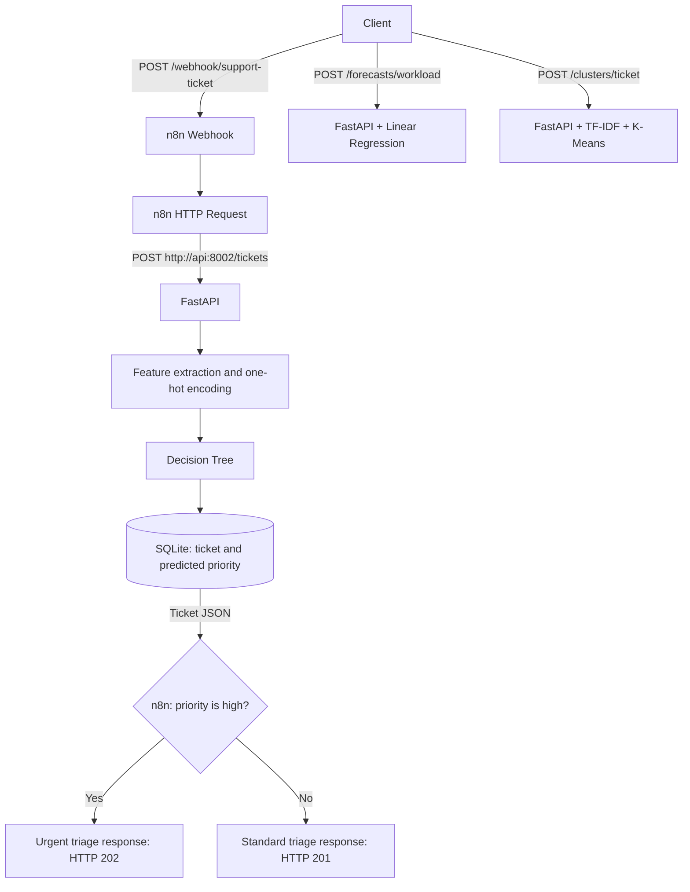

# Support Ops Intelligence

**Classical machine learning for support-ticket prioritization, workload forecasting, and topic discovery.**

[](https://github.com/Mykhailo-Surovtsev/support_ops_intelligence/actions/workflows/tests.yml)
[](https://github.com/Mykhailo-Surovtsev/support_ops_intelligence/actions/workflows/docker.yml)

## Overview

Support Ops Intelligence connects three scikit-learn models to a FastAPI service and an n8n automation workflow. It demonstrates the path from training data to saved model artifacts, API inference, persistent ticket storage, and conditional webhook responses.

The service predicts whether a support ticket has low, medium, or high priority; estimates daily ticket volume for a supplied business scenario; and groups ticket text into recurring topics. Docker Compose runs the API and n8n together, while GitHub Actions checks tests and image builds.

This is a portfolio project built with deterministic synthetic data. Its metrics describe performance on the generated datasets, not accuracy on real customer support requests.

## Tech Stack

| Component | Technologies |
| --- | --- |
| Language and API | Python 3.14, FastAPI, Pydantic, Uvicorn |
| Machine learning | scikit-learn, Decision Tree, Linear Regression, TF-IDF, K-Means |
| Data and artifacts | pandas, SQLite, CSV, Joblib |
| Automation | n8n, HTTP webhooks, conditional routing |
| Local deployment | Docker, Docker Compose, container health checks |
| Testing and CI | pytest, FastAPI TestClient, GitHub Actions |

## Machine Learning Architecture

### Ticket-Priority Classification

A `DecisionTreeClassifier` predicts `low`, `medium`, or `high` from six features: channel, customer tier, description length, payment-keyword presence, outage-keyword presence, and exclamation count. Keyword features are extracted from the combined subject and description.

Categorical features pass through `OneHotEncoder(handle_unknown="ignore")`; numerical features pass through unchanged. Both preprocessing and classification are saved in a single scikit-learn `Pipeline`.

- **Dataset:** 400 generated tickets with rule-based labels and randomized label noise.
- **Split:** 300 training rows and 100 validation rows, stratified by priority with `random_state=42`.
- **Model:** maximum depth of 4 and a minimum of 5 samples per leaf.
- **Evaluation:** accuracy plus per-class precision, recall, and F1-score.

The shallow tree provides a compact baseline for structured ticket features. It does not learn general language understanding from the ticket text.

### Workload Forecasting

A `LinearRegression` pipeline estimates daily ticket volume from day of week, active customers, a marketing-campaign flag, and an incident flag. Day of week is one-hot encoded.

- **Dataset:** 180 generated daily observations, stored in chronological order.
- **Split:** the first 150 rows are used for training; the final 30 rows are used for validation.
- **Evaluation:** mean absolute error (MAE) and R².
- **API output:** the estimate is rounded to an integer and clipped at zero.

This is scenario-based regression: callers supply the expected conditions. The model does not predict future incidents or generate a multi-day forecast automatically. If the input dataset is replaced, its rows must remain ordered by date before training.

### Topic Clustering

`TfidfVectorizer` converts each ticket's subject and description into unigram and bigram features, removes English stop words, and ignores terms appearing in fewer than two documents. `KMeans` then groups the vectors into three clusters using `random_state=42` and `n_init=20`.

The API returns a cluster ID and the six highest-weighted terms in that cluster's centroid. These terms help inspect the grouping; they are not a predefined topic taxonomy. Cluster IDs have no fixed semantic meaning, and some groups contain mixed themes.

### Recorded Results

The following results were recorded with the generated datasets included in this repository:

| Task | Evaluation setup | Metric | Result |
| --- | --- | --- | --- |
| Priority classification | Stratified 300 / 100 train-validation split | Accuracy | **0.97** |
| Workload forecasting | Chronological 150 / 30 train-validation split | MAE | **3.06 tickets** |
| Workload forecasting | Same chronological holdout | R² | **0.947** |
| Topic clustering | All 400 fitted ticket vectors; 3 clusters | Silhouette score | **0.389** |

The clustering score is computed on the same vectors used to fit the model, rather than on a separate holdout. Ticket templates can appear in both classification splits, and workload targets follow a synthetic formula. These results help check the implementation and generated patterns; they do not establish generalization to real support data. Results may also vary when dependency versions change.

## System Architecture



Models are trained separately from request handling, serialized with Joblib, and loaded lazily with an in-process cache. SQLite stores ticket fields, the predicted priority, an ID, and a UTC creation timestamp. Forecasts and topic assignments are returned without being stored.

The n8n workflow branches on the API's prediction and returns the ticket JSON. It currently demonstrates routing through response nodes; it does not send alerts or create assignments in an external support system.

## Getting Started

### 1. Clone the Repository

The commands below use Windows PowerShell. Docker Desktop must be running with Linux containers enabled for the Compose setup.

```powershell
git clone https://github.com/Mykhailo-Surovtsev/support_ops_intelligence.git support-ops-intelligence
cd support-ops-intelligence
```

If you already have the project locally, open a terminal in its root directory. No LLM API key is required.

### 2. Start the Docker Compose Stack

Make sure ports `8002` and `5678` are available. Create the external volume referenced by Compose, then build and start both services:

```powershell
docker volume create n8n_data
docker compose up --build --detach
docker compose ps
```

The image build installs dependencies and trains all three models from the tracked CSV files. n8n starts after the API passes its Docker health check.

| Service | Address |
| --- | --- |
| Interactive API documentation | [http://127.0.0.1:8002/docs](http://127.0.0.1:8002/docs) |
| API health check | [http://127.0.0.1:8002/health](http://127.0.0.1:8002/health) |
| n8n editor | [http://127.0.0.1:5678](http://127.0.0.1:5678) |

The API bind-mounts `./data` at `/app/data`, keeping the SQLite database on the host. n8n uses the external `n8n_data` volume for its configuration, account, and workflows. An existing volume is reused; a new volume starts with an empty n8n instance.

### 3. Import and Publish the n8n Workflow

On a fresh n8n instance, complete account setup, create a workflow, and use **Import from File** in the workflow menu to load [the exported workflow](automation/route-support-ticket-by-priority.json). Import is a manual step; Compose does not load the JSON automatically.

Check these settings, then save and **Publish** the workflow:

| Node | Configuration |
| --- | --- |
| Webhook | `POST`, path `support-ticket`, respond using a Respond to Webhook node |
| HTTP Request | `POST http://api:8002/tickets`; forward the four ticket fields from the webhook body |
| If | Compare `predicted_priority` with `high` |
| Respond - urgent triage | Return the first incoming item with HTTP `202` |
| Respond - standard triage | Return the first incoming item with HTTP `201` |

Within the Compose network, `api` is the API service name. Use `127.0.0.1` for browser access and `api:8002` for the workflow's internal request. If the workflow already exists in your n8n volume, update and publish it instead of importing a duplicate.

### 4. Test Both Routes

Run the following from the project root after publishing the workflow:

```powershell
$webhookRequest = @{
    UseBasicParsing = $true
    Method = "Post"
    Uri = "http://127.0.0.1:5678/webhook/support-ticket"
    ContentType = "application/json"
    InFile = ".\examples\n8n_low_ticket.json"
}

$lowResponse = Invoke-WebRequest @webhookRequest
$lowResponse.StatusCode
$lowResponse.Content

$webhookRequest.InFile = ".\examples\n8n_high_ticket.json"
$highResponse = Invoke-WebRequest @webhookRequest
$highResponse.StatusCode
$highResponse.Content
```

With the supplied examples and recorded model behavior, the low-priority request returns `201` and `predicted_priority: low`; the high-priority request returns `202` and `predicted_priority: high`. Inspect production runs in n8n's **Executions** tab. Each request creates a new ticket in SQLite.

To inspect logs or stop the stack while keeping its stored data:

```powershell
docker compose logs --tail 50 api n8n
docker compose down
```

## Run the API Locally

For Python development without the Compose stack, use Python 3.14 and run these commands from the project root:

```powershell
python -m venv .venv
.\.venv\Scripts\Activate.ps1
python -m pip install -r requirements.txt
python -m app.ml.priority_model
python -m app.ml.workload_model
python -m app.ml.topic_clustering
python -m uvicorn app.main:app --reload --port 8002
```

The CSV datasets are included in Git. To regenerate them before retraining:

```powershell
python -m app.ml.generate_training_data
python -m app.ml.generate_workload_data
```

Generated `.joblib` artifacts and the SQLite database are excluded from Git. Restart a running API after replacing its model artifacts, since previously loaded models are cached in memory. Dependency ranges are specified in `requirements.txt`; the project does not currently include a dependency lockfile.

## API Reference

| Method | Endpoint | Behavior | Success status |
| --- | --- | --- | --- |
| `GET` | `/health` | Return `{"status": "ok"}` | `200` |
| `POST` | `/tickets` | Predict priority and persist the ticket | `201` |
| `POST` | `/forecasts/workload` | Estimate ticket count for a scenario | `200` |
| `POST` | `/clusters/ticket` | Return cluster ID and top terms | `200` |

Pydantic rejects invalid request fields with `422`. Inference endpoints return `503` when a required model artifact is missing. `/health` is a liveness check; it does not verify that all three models can be loaded.

### Create a Ticket

Send this body to `POST /tickets` through Swagger UI:

```json
{
  "subject": "Service outage",
  "description": "Customers cannot access the dashboard and the entire team is blocked.",
  "channel": "web",
  "customer_tier": "enterprise"
}
```

The response includes the original fields plus `id`, `predicted_priority`, and `created_at`. Supported channels are `email`, `chat`, and `web`; customer tiers are `free`, `pro`, and `enterprise`.

The API returns `201` for every successfully created ticket, regardless of priority. The separate n8n workflow chooses `202` or `201` for its own webhook response; those codes do not measure model confidence or prove that human triage occurred.

### Forecast Ticket Volume

Request body for `POST /forecasts/workload`:

```json
{
  "day_of_week": "Monday",
  "active_customers": 1500,
  "marketing_campaign": true,
  "incident_active": false
}
```

Example response from the recorded model run:

```json
{
  "predicted_ticket_count": 56
}
```

### Assign a Topic Cluster

Request body for `POST /clusters/ticket`:

```json
{
  "subject": "Refund charged twice",
  "description": "I was charged twice and need a refund."
}
```

Example response from the recorded model run:

```json
{
  "cluster_id": 0,
  "top_terms": ["feature", "payment", "refund", "charged", "charged twice", "twice"]
}
```

## Testing and Continuous Integration

Run the API test suite from the project root with the virtual environment activated:

```powershell
python -m pytest tests -q
```

The current suite has seven tests covering health, ticket creation, request validation, missing-model handling, workload responses, and clustering responses. Prediction functions are substituted in the API behavior tests; these tests do not establish model quality. Training scripts print the ML evaluation metrics separately.

Two GitHub Actions workflows run on pushes to `main` and pull requests targeting `main`:

- **Run tests:** install dependencies, train all three model artifacts, and run pytest on Ubuntu with Python 3.14.
- **Verify Docker image builds:** build the Docker image, including its model-training steps.

CI checks tests and builds. It does not deploy a hosted service or run the complete n8n workflow; webhook routing is checked separately with the supplied examples.

## Project Structure

```text
support-ops-intelligence/
├── app/
│   ├── main.py                        # FastAPI endpoints and application lifespan
│   ├── schemas.py                     # Request and response validation
│   ├── database.py                    # SQLite ticket persistence
│   └── ml/
│       ├── generate_training_data.py  # Synthetic ticket generator
│       ├── generate_workload_data.py  # Synthetic daily workload generator
│       ├── priority_model.py          # Classification training and inference
│       ├── workload_model.py          # Regression training and inference
│       └── topic_clustering.py        # TF-IDF and K-Means pipeline
├── automation/
│   └── route-support-ticket-by-priority.json
├── examples/
│   ├── n8n_low_ticket.json
│   └── n8n_high_ticket.json
├── data/
│   ├── training_tickets.csv
│   └── workload_history.csv
├── models/                            # Generated Joblib artifacts; ignored by Git
├── tests/
│   └── test_api.py
├── .github/workflows/
│   ├── tests.yml
│   └── docker.yml
├── Dockerfile
├── .dockerignore
├── compose.yaml
├── requirements.txt
└── README.md
```

## Troubleshooting

| Symptom | Check |
| --- | --- |
| `ModuleNotFoundError: No module named 'app'` during test collection | Use `python -m pytest tests -q` from the project root. |
| External volume `n8n_data` not found | Run `docker volume create n8n_data` before starting Compose. |
| Container-name conflict or occupied port | Inspect `docker ps -a`; stop the earlier instance of this project's service before starting Compose. |
| Webhook returns `404` | Publish the workflow and use `/webhook/support-ticket`; the test URL `/webhook-test/support-ticket` requires an active test listener. |
| n8n cannot reach the API | Check `docker compose ps` and the HTTP Request URL: `http://api:8002/tickets` inside Compose. |
| API returns `503` for a missing model | Train the corresponding model locally, or rebuild the API image. |

## Limitations and Next Steps

- Validate on representative historical tickets and compare against simple baselines; current data and reported metrics are synthetic.
- Evaluate cluster quality with human review and select the number of clusters experimentally; the current value is fixed at three.
- Add API authentication, request limits, and protected webhook access before exposing the service beyond local development.
- Add model-readiness checks, versioned artifacts, and dependency locking; current artifacts are trained during the image build.
- Add automated Compose integration tests, inference monitoring, and data-drift checks.
- Connect triage branches to an actual notification or assignment system, and use a server database if multiple API instances need shared storage.
